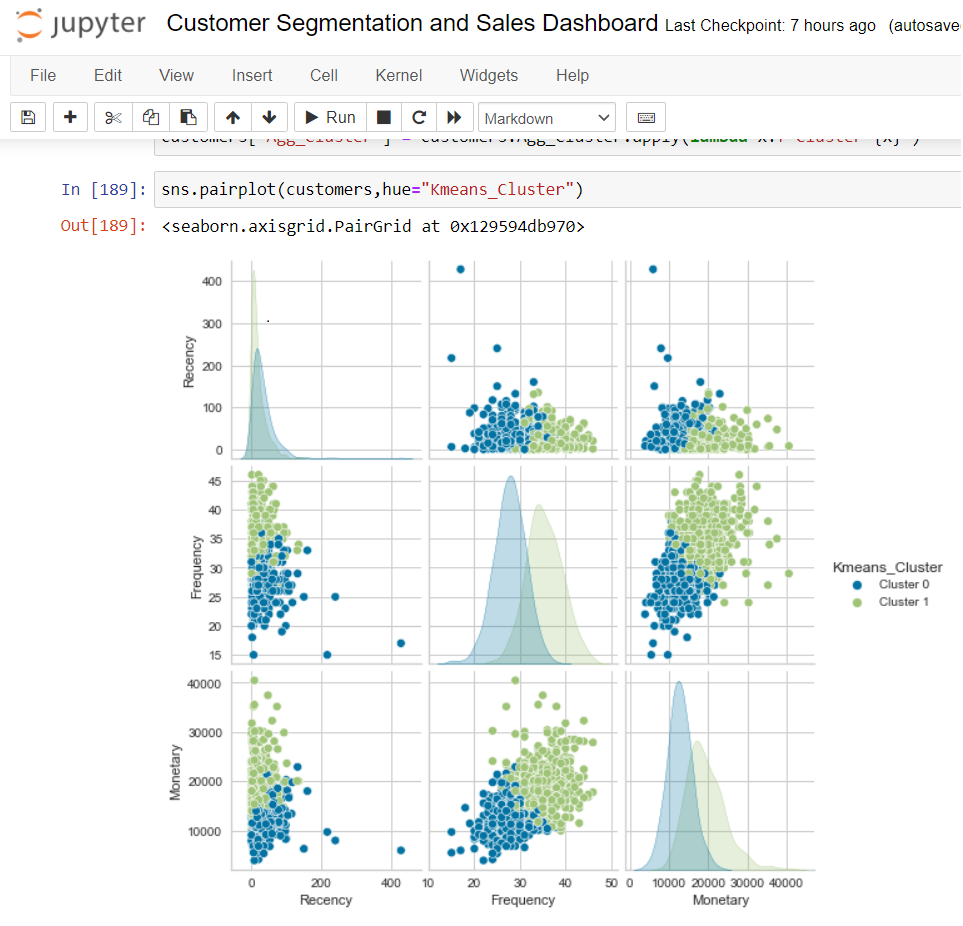
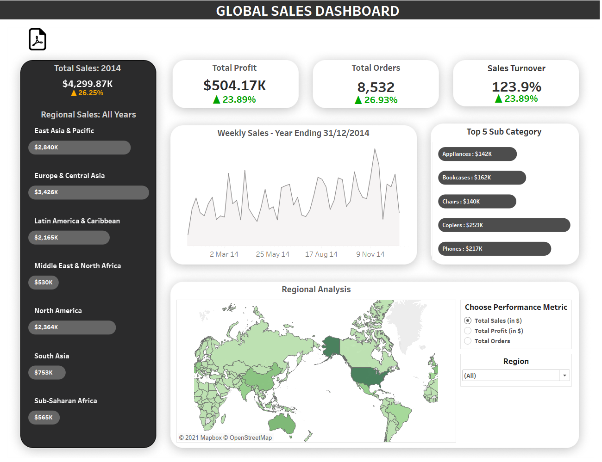
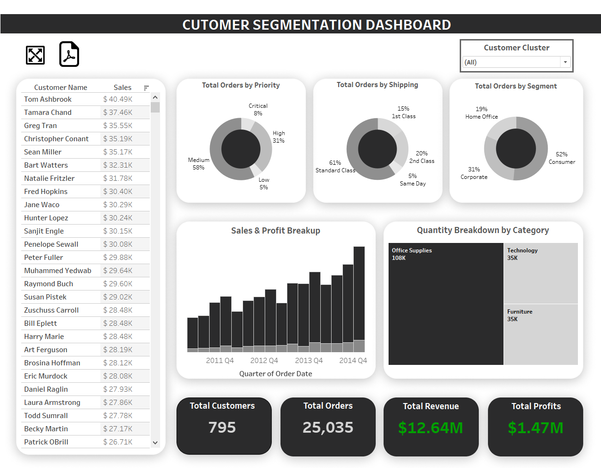
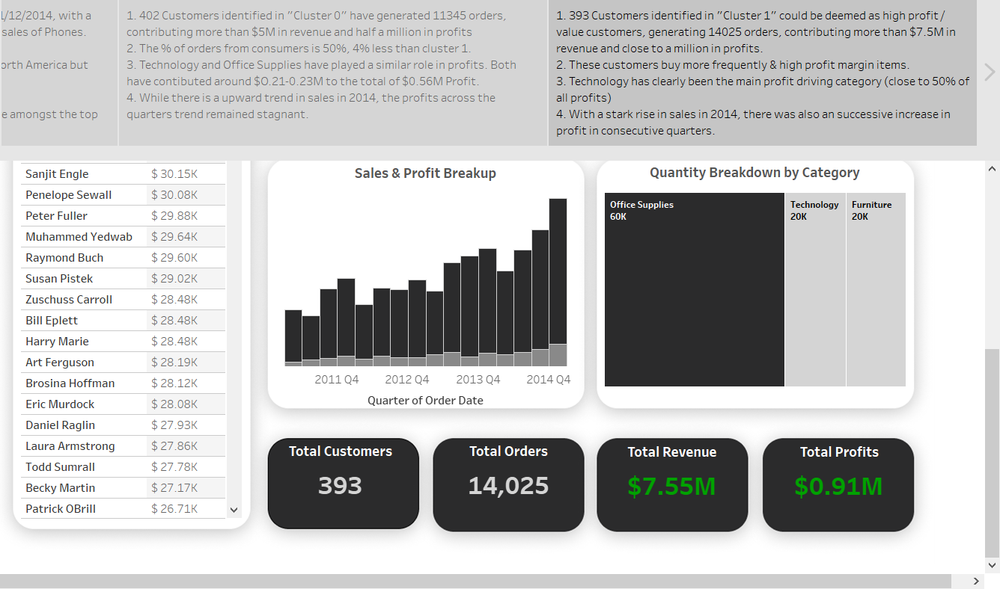

# E-commerce-Global-Superstore-Sales-Customer-Clustering-Dashboard-
A python cum Tableau project involving use of clustering to identify customer segments and create dashboards to analyze sales and customers (including new clusters)

## Tasks- We have a dataset pertaining to the sales of an online global superstore. We are going to perform the following tasks:
1.Identify clusters of Customers using Unsupervised Machine Learning Algorithms.

2.Create Dashboards in Tableau to visualize and analyse a) The sales performance of the store & b) customers and the new clusters groups.
    
The project will involve the use of the following tools and skills - 
1. Python
2. Machine Learning - Unsupervised learning
3. MySQL
4. Tableau
5. Figma
6. Data Visualization - Dashboard creation

## Description - 
### Step 1- Data Cleaning and Preparation:
1. The data was loaded into python using jupyter notebook.
2. Initial checks were performed to understand the structure and characteristics of the dataset like size, shape, missing values, count of categorical & numerical columns.
3. Several categorical features like City, State, Product Name, Category, etc were checked for  leading spaces, special characters, correct category names, etc.
4. Missing values were detected only in postal code.
5. Country had names which were either abbreviated or doubtful of being recognized in tableau.
6. Region was a feature with too many different categories and ambigious regions.
7. To make necessary corrections to country name and replace existing categories in region with lesser and more significant names, the World Indicators dataset was downloaded and imported into python.
8. Using joins and country names/code, the country names were replaced with names which are identified by tableau.
9. Regions were also replaced with more appropriate categories using country name or code with joins.
10. Columns which were not required for our dashboard were dropped.

### Step 2- Clustering:
1. In order to perform clustering, the RFM framework was followed where clustering of customers would be done on the basis of recency, frequency and monetary value of their purchases.
2. A new dataset was created with customer id as index and new columns for recency, frequency and monetary value.
3. Extreme / High value outliers were detected, which were removed using power transformer.
4. All features were scaled for uniform scales required for optimum clustering.
5. K-means and Agglomerative clustering were used to find optimum no. of clusters for customers
6. Cluster quality were evaluated using inertia, silhoutte scores, elbow plots, dendograms, etc.
7. Optimum no. of clusters identified were 2, with a silhoutte score of around 0.30 for K-means and 0.25 for Agglomerative clustering.
# Kmeans Clusters

9. New cluster labels were added to dataset.

### Step 3 - Transferring data to MySQL
1. The sql alchemy package was imported to create a connection object required to connect python to mysql server.
2. Using new connection, the final dataframe created was transferred from jupyter notebook to a new table created in a new database in mysql workbench.

### Step 4 - Creating Charts and Dashboards
1. Using OBDC drivers, Tabeau was connected to MySQL Workbench and the data was pulled.

A. Sales Dashboard - 
  1. Charts like sales, profit, sales per region, top 5 sub category, customer details, monthly sales, etc were created using several types of charts like line, donut, tree map, bar charts, world maps, etc.
  2. Template for the dashboard were created using Figma, an online platform.

The following dashboards were finally created

# SALES DASHBOARD

# CUSTOMER SEGMENTATION/CLUSTER DASHBOARD

# CLUSTER 0

# CLUSTER 1

### Link to Live Dashboards and Storyboard- 
https://public.tableau.com/app/profile/varun.sagar.theegala/viz/GlobalSalesCustomerSegmentation/GlobalSalesDashboard
